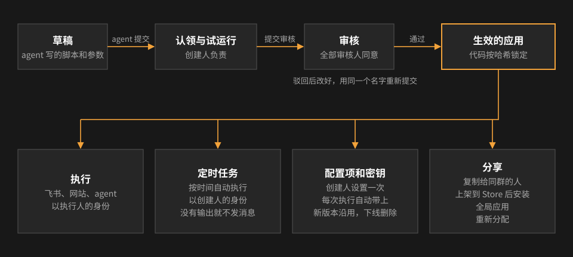
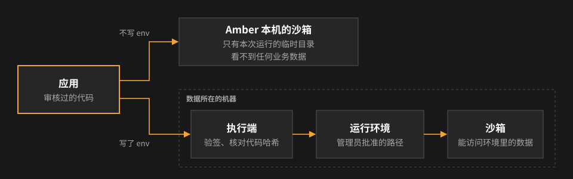

# 概念模型

这一页给开发人员和想了解原理的人：Amber 里的主要对象是什么、它们之间是什么关系、由谁决定。日常使用不需要读。

## 总览

## 应用、版本和指令线

- **应用**：一段审核过的脚本，加上它的参数和选项。审核通过的那一份按内容算一个哈希（spec hash），执行前每次都核对，代码有任何改动都要重新审核。
- **版本**：同一个应用的新版本是一条新的记录，审核通过后替换旧版本（旧版本变成「已下线」）。同一时间一个应用只有一个生效的版本，和至多一个在认领或审核中的版本。
- **指令线**（line）：把一个应用的各个版本串起来的身份。配置项、密钥都挂在「群 + 指令线」上，所以出新版本时沿用，下线时删除。agent 提交的应用，指令线就是它的名字；从 Store 装的、复制来的应用有各自的指令线，所以同一个群里几个人可以各有一个同名应用，互不相干。
- **创建人**：认领应用的人，是这个应用的负责人。

## 可见范围

- 一个应用属于创建它的人，建在哪个群（或私聊）就在哪里用。**只有创建人自己看得见、能执行。**
- **全局应用**：管理员设为全局后，所有人在所有地方都能执行，共用一份配置项和密钥。
- **管理员**能看到所有应用、能管理（下线、设置、暂停定时任务、重新分配），但不能执行别人的应用。

## 执行身份

- 每次执行都有一个执行人：发消息或点卡片的人；agent 发起的，是点确认卡的人；定时任务是定时任务的创建人。身份只来自飞书事件或网站登录，agent 和脚本给不出身份。
- 应用声明了**数据服务**时，Amber 每次执行给服务签发一张代表执行人的短时效签名凭证（每次调用一张，用过作废），服务按执行人的权限返回数据。见[可信身份](identity.md)。
- 不需要身份的应用（不调数据服务、不需要确认、不用密钥），agent 可以直接执行，执行人记为 agent。

## 审核

- 新应用、新版本、上架都要审核；全部审核人同意才生效。
- 审核看的是代码和它声明的能力：参数和配置项、密钥名字、是否联网、调用哪些服务、执行位置、执行前确认、允许定时。这些都写在应用定义里，随代码一起锁定。
- 下线、全局化、重新分配、复制、安装都不需要审核：它们用的都是已经审核过的版本，或者只会缩小能力。

## 参数、配置项、密钥

| | 谁填 | 什么时候 | 保密 | 能不能被执行人改 |
|---|---|---|---|---|
| 参数 | 执行人 | 每次执行 | 否 | 能 |
| 配置项 | 创建人或管理员，在网站上 | 设置一次，每次执行自动带上 | 否 | 不能 |
| 密钥 | 创建人或管理员，在私聊卡片或网站上 | 设置一次 | 是：加密保存，只交给这个应用，输出里出现会被遮盖 | 不能 |

名字和类型随代码审核，值不审核。

## 定时任务

- 定时任务 = 应用 + 参数 + 时间规则 + 创建人。每次以创建人身份执行，结果发到创建时的群、话题或私聊；没有输出就不发。
- 应用下线、出新版本、不再允许定时、创建人退群时自动暂停。定时任务不能转给别人。

## Amber Store

- **Store 应用**：从一个生效中的应用上架而来，每个版本都是一份审核过的定义。
- **原版**：发起上架的那个应用。它审核通过的新版本，就是 Store 应用的新版本。
- **安装**：在某个群或私聊里新建一个属于安装人的应用，内容和 Store 应用的某个版本一致，直接生效，不审批。安装人自己设置配置项和密钥，自己决定什么时候升级。
- **维护人**：原版的创建人（管理员可以更换）。可以下架、重新上架；原版下线后可以用开发模式安装，让一份安装成为新的原版。

## 其他分享方式

- **复制给群成员**：创建人把群应用复制一份给同群的人，对方接收后是一个独立的新应用（自己的指令线），复制配置项、不复制密钥。
- **重新分配**：创建人离群后，管理员把应用交给群里另一个人；应用不变，只换创建人，配置项和密钥保留。

四种方式的对比见[应用的分享](sharing.md)。

## 页面应用

[页面应用](pages.md)是 agent 写的一个网页（一个目录的静态文件），属于创建人，挂在一个群或私聊下面。它本身不是应用，而是应用的一种用法：

- **绑定**：页面在 `amber.json` 里写明会调用哪些应用。创建人在确认卡片上点「确认发布」时，Amber 把这些名字绑定到具体的应用：必须是创建人自己在这个群（或私聊）里的应用，或者全局应用。页面只能调用绑定的这几个；要换，就重新确认
- **谁能打开**：创建人决定：只有自己（默认）、群里所有人、或指定的群成员。每次打开、每次调用都检查名单，并且要求这个人现在还在群里
- **执行身份**：页面里调用应用，**以打开页面的人自己的身份执行**，和他在飞书里执行一样。所以创建人可以把自己的应用通过页面借给群里指定的人用。两个例外：用到密钥的应用只有创建人能通过页面调用（否则等于把创建人的凭证借出去）；会改数据的应用由 Amber 自己弹确认框
- **不审核**：页面运行在单独的域名和隔离的框里，不能联网、不能跳转到外部网站，只能经 Amber 调用绑定的应用。所以页面写成什么样，打开它的人也只能拿到他自己有权拿到的数据，数据也传不出去。应用本身照常审核
- **版本**：每次发布是一个新版本。只改内容直接替换；调用的应用变了要重新确认，确认前线上仍是旧版本

## 执行位置：执行端、运行环境、沙箱

| 概念 | 是什么 |
|---|---|
| **沙箱** | 每次执行都在 macOS 沙箱里跑：默认只能读写本次运行的临时目录，读系统目录和常见工具链；不能直连网络，只能经代理访问执行位置的网络白名单；声明了「可以访问外网」才能直连 |
| **执行端** | 装在数据所在机器上的执行程序，管理员核对公钥指纹后批准。Amber 把任务加密发给它，它在本机执行后把结果签名返回 |
| **运行环境** | 执行端上一个有名字的权限范围：能读写、只读、禁止哪些路径，工作目录、Python、环境变量。可以从 botmux 机器人导出（和机器人自己的沙箱权限一致）。管理员批准 |

应用写了 `env: "执行端名/环境名"` 就在那里运行，能访问的数据完全由环境决定；不写就在 Amber 本机的沙箱里运行，看不到任何业务数据。执行端上的应用调用数据服务时，请求经 Amber 转发，身份规则不变。详见[执行端与运行环境](executor.md)和[运行环境定义格式](environment-format.md)。
