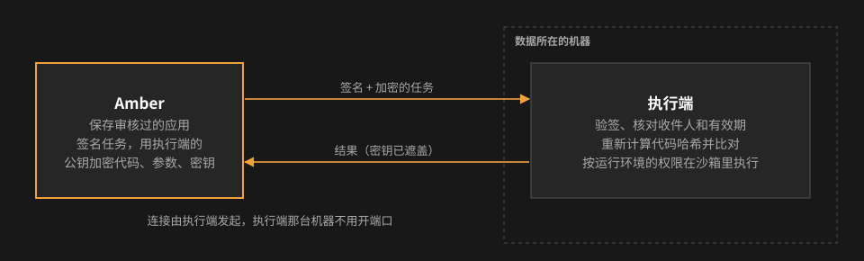

# 执行端：在数据所在的机器上执行应用

有些应用要读机器人在自己机器上建的数据，比如台账、导出目录。这些数据不在 Amber 的机器上。**执行端**是装在数据所在机器上的一个小程序：Amber 把审核通过的应用交给它，它在本机的一个**运行环境**里执行，再把结果交回 Amber。结果卡片、运行记录、定时任务、网站和以前完全一样。

执行端是通用的：Amber 不关心那台机器是谁的、跑着哪个机器人、数据是什么格式。应用只写明在哪个执行端的哪个环境里跑（随代码审核）；能访问哪些数据，完全由那个环境决定（由管理员批准）。

## 概念：机器、执行端、运行环境、沙箱

| 概念 | 是什么 | 谁来定 | 什么时候生效 |
|---|---|---|---|
| 机器 | 应用实际执行的那台电脑。不写 `env` 的应用在 Amber 所在的机器上执行 | — | — |
| 执行端 | 装在某台机器上的 Amber 执行程序，一台机器一个，名字一般就是机器名 | 机器的主人安装，管理员核对公钥指纹后批准 | 批准后一直有效，直到撤销 |
| 运行环境（env） | 执行端上一个有名字的**权限范围**：能读写哪些路径、只读哪些、禁止哪些，以及 `{WORKDIR}`、Python、给脚本的环境变量。一个执行端可以有多个（最多 20 个） | 机器的主人登记（一份 JSON 定义，可以用 env set 生成，或从 botmux 机器人导出），管理员批准；增加或修改都要重新批准 | 批准后一直有效 |
| `{WORKDIR}` | 运行环境的主目录。脚本从环境变量 `WORKDIR` 拿到它 | 由运行环境决定 | — |
| 沙箱 | 执行时按运行环境的权限临时生成的隔离规则，保证脚本访问不到环境以外的东西 | 不由人写，自动生成 | 每次执行时生成，执行完就消失 |

它们之间的关系：

- **一个应用 = 在哪里跑（`env`，可不写）+ 代码**。应用里**不写任何路径**，能访问什么完全由运行环境决定。
- **不写 `env` 的应用**在 Amber 本机跑，不访问任何业务数据：系统目录和常用工具链只读；只能读写本次运行的临时目录（也是当前目录和 `HOME`）。
- **运行环境不会自动创建**：应用只能引用已经登记、批准过的环境；引用不存在的环境，认领卡上会提示，执行时失败。
- **同一个运行环境里的应用权限相同**。需要区分时，就登记不同的环境，比如同一个机器人登记「结算助手」（可读写）和「结算助手-只读」两个环境，报表类应用用只读的那个。
- **运行环境就是一份访问规则（JSON 定义文件）**，执行端只有这一种机制。生成它有两种快捷方式，也可以手写后 `env import`：
  - `env set 名字 目录`：最简单的一份，`{WORKDIR}` 这个目录可读写（加 `--readonly` 只读）。
  - `export-botmux-env.mjs`：从 botmux 机器人导出，和这个机器人在 botmux 沙箱里能访问的数据完全一样（工作目录、角色库、机器人目录、bots.json 里配的路径、它自己的 lark-cli 飞书身份），只去掉 botmux 的发消息凭证。脚本里用 lark-cli，用的就是这个机器人的身份，和它的会话一致。
- **联网**仍由应用自己声明（`network: true`），随代码审核；联网和调用内部服务二选一。
- **调用 Amber 上登记的服务**（比如 data-mcp，企业内部的数仓应用，Amber 把它作为可信服务访问）：管理员允许的服务，执行端上的应用也能调用，写法和在 Amber 本机完全一样，见下面「调用 Amber 上登记的服务」。
- **任何环境都打不开的**：Amber 和执行端自己的配置目录（签名私钥、加密密钥、数据库）、`~/.ssh`、钥匙串。其他凭证目录（`~/.botmux`、`~/.lark-cli-bots`、`~/.claude` 等）默认也打不开，只有环境里明确列出的那一部分才开放，批准卡上会单独标出「含凭证路径」。

## 工作方式



- **只注册一次**：执行端第一次启动时在本机生成密钥（私钥不离开这台机器），把名字、环境列表和公钥发给 Amber 申请登记。
- **管理员批准**：Amber 给每位管理员发一张卡片，上面有来源机器、每个环境的全部路径和**公钥指纹**。管理员和安装的人核对指纹一致后点「批准」。批准前不会派任何任务。
- **执行端主动连 Amber**：执行端一直保持一个长连接等任务，这个连接本身就是心跳。不用在执行端那台机器上开端口。
- **任务**：由 Amber 的签名密钥签名，内容（代码、参数、密钥）用执行端的公钥加密。执行端要逐项检查：签名、收件人是不是自己、有没有过期、是不是重复的任务；然后重新计算规格哈希，和审核通过的版本比对。都通过才执行。
- **执行**：按运行环境的权限生成沙箱后执行，规则和 Amber 本机完全相同（执行端的这部分代码是从 Amber 的源码生成的）。当前目录是每次执行新建的临时目录。执行端自己的密钥，任何环境都打不开（这一个约束的是应用脚本；同一系统用户下沙箱外的其他进程见下面「用哪个系统用户安装」）。
- **离线不补跑**：执行端离线（约 1 分钟没联系）时，派给它的应用立即失败，结果卡写明「执行端离线」。任务 30 秒内没被取走，或者超过脚本超时还没有返回，也会失败。失败的任务不会在执行端恢复后补跑。

以下情况需要**重新批准**：

| 情况 | 说明 |
|---|---|
| 换了密钥 | 重装、换机器、私钥丢失。新密钥是一次新的申请 |
| 环境变了 | 增加、删除环境，或者改了环境的任何内容（路径、Python、环境变量）。批准失效，直到管理员批准新的内容 |
| 被撤销 | 管理员撤销后立即生效；要恢复，得重新生成密钥再申请 |

重启服务、重启机器、断网后重新连上，都不需要重新批准。

## 安装（在数据所在的机器上）

要求：macOS，Node 22 或更新版本。这台机器的 IP 要在 Amber 的白名单里，和 agent 用 `amber` 命令的要求一样。

```bash
# 1. 拿到代码（只用 client/amber-executor 这个目录，不需要安装依赖）
git clone https://github.com/xu4wang/amber.git ~/amber

# 2. 初始化：起个名字（小写字母、数字、连字符）。Amber 地址默认读 amber 命令的配置
node ~/amber/client/amber-executor/amber-executor.mjs init --name ledger-mac
#    输出里有「公钥指纹」，记下来，等会儿要和管理员核对

# 3. 放运行环境：~/.config/amber-executor/envs/ 里一个 <环境名>.json 就是一个环境。下面几种方式都只是往这里写文件
#  a. 用一个目录生成：这个目录可读写（加 --readonly 就是只读）；需要第三方包时用 --python 指定解释器
node ~/amber/client/amber-executor/amber-executor.mjs env set 台账 /Users/me/bots/ledger --python /Users/me/venvs/ledger/bin/python3
#  b. 从 botmux 导出某个机器人的访问权限，直接写进文件夹
node ~/amber/client/amber-executor/export-botmux-env.mjs --bot cli_xxxx --name 结算助手 --python /opt/homebrew/bin/python3 --out ~/.config/amber-executor/envs/结算助手.json
#     只读版本：导出时加 --readonly，写成另一个文件名
#  c. 手写或别处生成的定义：… env import 文件.json（先校验再放进文件夹），或者直接复制进去
#  查看：… env show；看某个环境的文件：… env export 台账；删除：… env rm 台账（或直接删文件）

# 4. 常驻运行（launchd，开机自动启动），同时向 Amber 申请登记
node ~/amber/client/amber-executor/amber-executor.mjs install-launchd

# 5. 查看状态；管理员批准后这里显示「已批准」
node ~/amber/client/amber-executor/amber-executor.mjs status
```

配置和密钥在 `~/.config/amber-executor/`（目录权限 700，密钥文件 600），日志在同一目录的 `executor.log`。停用：`… uninstall-launchd`。

**用哪个系统用户安装**：文件权限只挡得住其他用户，挡不住同一个用户的其他进程。同一用户下没有沙箱的进程（比如不开沙箱的机器人、agent）都能读到执行端的私钥，拿到私钥就能冒充这个执行端、解密派给它的任务，包括里面的密钥。所以：

- 最稳妥的做法是给执行端单独建一个系统用户，用它安装、运行（数据目录给这个用户读权限）；
- 如果装在和机器人相同的用户下，就等于信任这个用户下的所有进程，只适合这些进程本来就可信的机器；或者它们都在沙箱里，并且确认沙箱挡住了 `~/.config/amber-executor/`。批准时管理员要知道是哪种情况。

### 环境文件夹：改了怎么生效

执行端每 5 分钟读一次 `~/.config/amber-executor/envs/`，有变化就重新登记到 Amber：

| 文件夹里的变化 | 结果 |
|---|---|
| 新放进一个文件 | 新增环境，**要管理员批准**（批准前这个执行端的所有环境暂停） |
| 改了已有文件里的路径、环境变量、Python | **直接生效**，Amber 给管理员发变化通知卡：新增和去掉了哪些路径，新增的凭证路径标红，卡上可以直接撤销这个执行端 |
| 改了已有文件里的 `workdir`、`source`、`realHome` | **要管理员批准** |
| 删掉一个文件 | 去掉这个环境（只会缩小权限），**直接生效**，通知管理员 |
| 文件损坏或校验不通过 | 保留它上一次的有效内容，在执行端日志里记一条，不登记变化 |

变化只对之后派发的任务生效：已经在运行的脚本按开始时的权限跑完（最长到脚本的时限，不超过管理员设的最长时限）。撤销执行端也一样：Amber 立刻停止派任务、不再接收结果、取消它还在进行的服务请求，但已经启动的脚本仍会跑到结束或超时。

想马上生效，不等 5 分钟：`launchctl kickstart -k gui/$(id -u)/com.amber.executor`。等待批准期间文件又变了，新的申请里会带上最新内容。

**跟随 botmux 机器人的配置**：机器人在 botmux 里的配置改了以后，**手工再跑一次导出命令**（上面安装第 3 步 b，`--out` 写回同一个文件），执行端会按上表自动处理；导出工具只有内容真的变了才会改写文件。可选：在导出命令后面加 `--install-launchd`，装成每 5 分钟自动导出一次的定时任务（`--uninstall-launchd` 移除）。

执行端只认这个文件夹里的文件，不知道 botmux 的存在；`export-botmux-env.mjs` 是 botmux 的适配层，以后 botmux 能直接输出这个文件，就不需要它了。

旧版本把环境记在 `config.json` 里，升级后执行端第一次启动会把它们原样搬进这个文件夹，内容不变，不需要重新批准。


初始化时执行端会记下 Amber 的签名公钥，之后只接受这把钥匙签的任务。Amber 换了签名密钥时，执行端会拒绝所有任务；确认是 Amber 自己换的之后，重新运行 `init … --repin`。

## 管理员

- 收到「执行端申请登记」卡片时，**先和安装的人核对公钥指纹**，再看来源机器和各环境的目录是否合理，然后批准或拒绝。
- 私聊 Amber 发「**执行端**」：列出所有执行端，包括状态、是否在线、最后在线时间。
- 发「**撤销执行端 名称**」：立即撤销，之后不再给它派任务，正在等结果的任务立即失败。
- **网站**：管理员在网站左侧会看到「执行端（管理员）」，能查看每个执行端的状态、是否在线、环境目录和公钥指纹，并在页面上批准、拒绝或撤销，效果和飞书卡片一样。其他人看不到这一栏。
- **同时运行上限**：每个执行端的页面上可以单独设置同时最多运行几个应用；不设就用「运行限制」里的执行端默认值（初始 4 个）。那台机器的主人也可以在 `~/.config/amber-executor/config.json` 里写 `"maxParallel": 6` 这样的数（1–64，不写是 4），重启执行端生效；实际取两边中小的。超过的执行会直接失败并提示稍后再试。

## 环境定义文件

运行环境用一份 JSON 定义，放在执行端的 `envs/` 文件夹里；`env set`、`env import` 和 `export-botmux-env.mjs --out` 只是往这个文件夹写文件的几种方式，`env export` 打印某个环境的文件。格式的完整说明（字段、路径解析、规则优先级、强制拒绝、校验清单、怎么映射到沙箱）见 **[运行环境定义格式](environment-format.md)**。这是一份独立于 Amber 的格式，其他 agent 平台、沙箱都可以照着生成或使用。

## 写应用（给 agent）

在 `script` 里加 `env`，**不写任何路径**：

```json
"script": {
  "kind": "script", "lang": "python",
  "env": "ledger-mac/结算助手",
  "code": "import os\nroot = os.environ['WORKDIR']\n…"
}
```

- 脚本能访问的，就是这个环境能访问的；用绝对路径访问（当前目录是临时目录），`WORKDIR` 从环境变量取。
- 要联网写 `"network": true`。要调用 Amber 上登记的服务（比如 data-mcp），照常写 `services`，见下一节。
- 认领卡和审核文档的「执行位置」一行会列出这个环境能访问的路径。执行端还没批准时，也可以先提交草稿和审核，只是试运行会提示「还没有被管理员批准」。
- 不知道有哪些环境时问用户；管理员私聊 Amber 发「执行端」，或在网站的执行端管理页查看。

## 调用 Amber 上登记的服务

data-mcp 这类服务装在 Amber 那台机器上，只监听本机。执行端上的应用照样可以调用，**脚本写法和在 Amber 本机完全一样**：

```python
svc = inp["services"]["data-mcp"]
req = urllib.request.Request(f"http://127.0.0.1:{svc['tcpPort']}/amber/query",
    data=json.dumps({"sql": SQL}).encode(),
    headers={"Authorization": "Amber " + svc["tokens"][0], "Content-Type": "application/json"})
```

怎么做到的：

1. 执行端在本机 `127.0.0.1` 上为这次任务开一个端口，把输入里的 `tcpPort` 换成它；沙箱只允许脚本连这个端口（macOS 沙箱只能限制到「本机端口」或「任何地址」，所以必须这样转一手）。这个端口只接受带着这次任务的凭证、并且这张凭证还没用过的请求，所以本机其他进程连上来也用不了；最多 8 个连接，请求要在 30 秒内发完。
2. 脚本的请求（路径、请求体、`Authorization`、`Content-Type`、`Accept` 头）由执行端加上自己的签名，原样转给 Amber 的 `/v1/executor/relay`。
3. Amber 核对：请求来自这次任务派给的那个执行端、任务正在运行、应用声明了这个服务、调用次数没超过声明的 `calls`、这个服务允许执行端调用。通过后原样转给本机的服务，再把响应原样带回。Amber 不读请求和响应的内容；身份凭证照常由服务自己校验。任务一结束（出结果、超时、执行端被撤销），还没完成的服务请求会被取消。

限制：

- 只有管理员在 Amber 配置里为服务打开了 `"executor": true` 的才能调用（data-mcp 已打开）；没打开的，提交草稿时就拒绝。
- 只支持 HTTP 的 GET / POST，请求最大 512KB，响应最大 4MB，单次 60 秒超时；不支持流式响应和 websocket。
- 只提供 `tcpPort`，不提供 `unixSocket`。
- 调用服务的应用仍然不能联网，查出来的数据只能输出到结果里。
- 执行端和 Amber 之间是普通 HTTP，查询和结果明文经过内网，可能被同网段看到（和其他执行结果一样）。但改不了、也冒用不了：转发请求带执行端的签名和一次性随机数，只对这次任务有效；Amber 的响应带 Amber 的签名并绑定到这一次请求，执行端核对不通过就不交给脚本。

## 安全边界

- 管理员批准的是**一把公钥 + 一组目录**。没有私钥的人冒充不了执行端：每个请求都有签名，并且带时间戳和一次性随机数，旧请求重放无效。
- Amber 和执行端之间走普通 HTTP。任务内容是加密的，密钥不会以明文经过网络。结果正文本身是明文，和网站、接口一样，只适合在内网使用。
- 「遮盖密钥」只是把输出里**原样出现**的密钥值换成 `***`（执行端和 Amber 各做一次）。它拦不住脚本把密钥变形后输出，也拦不住开了联网的脚本把密钥或数据发出去；环境允许读的文件，脚本也可以原样打印出来。这些都要靠审核把关：看代码怎么用密钥，看联网和读写目录是否必要。
- 执行端的私钥由运行它的系统用户保护，同一用户下的其他进程能读到，见上面「用哪个系统用户安装」。
- 执行端只跑签名有效、规格哈希与审核版本一致的代码，访问范围是那个运行环境批准过的路径。批准环境时要看清每一条路径，特别是标出的凭证路径；审核应用时要看它选了哪个环境、代码怎么用这些数据。
- 执行端以安装它的那个系统用户运行。不要用有特殊权限的账号安装。

## nginx

执行端用的是 `/v1/executor/…` 接口，和 agent 接口走同一个 `location /v1/`，不用另外配置。结果最大约 256KB，建议把 `client_max_body_size` 调到 `1m`。
